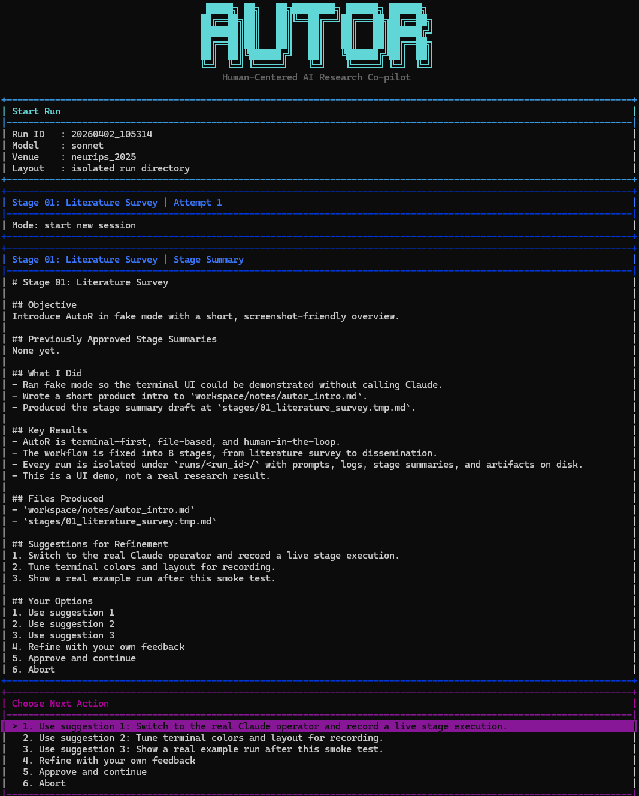
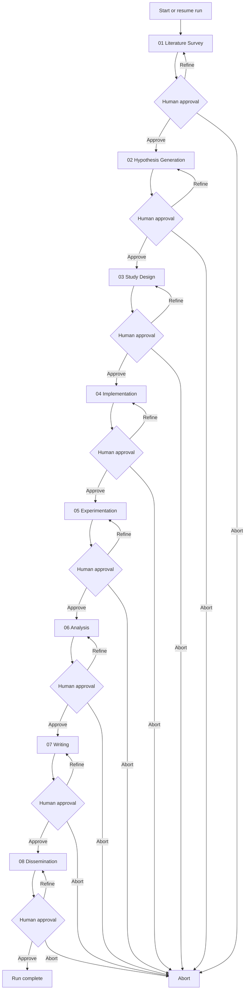
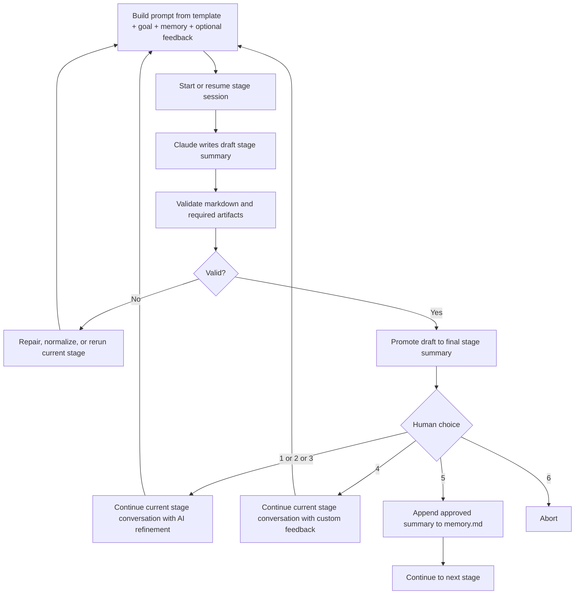
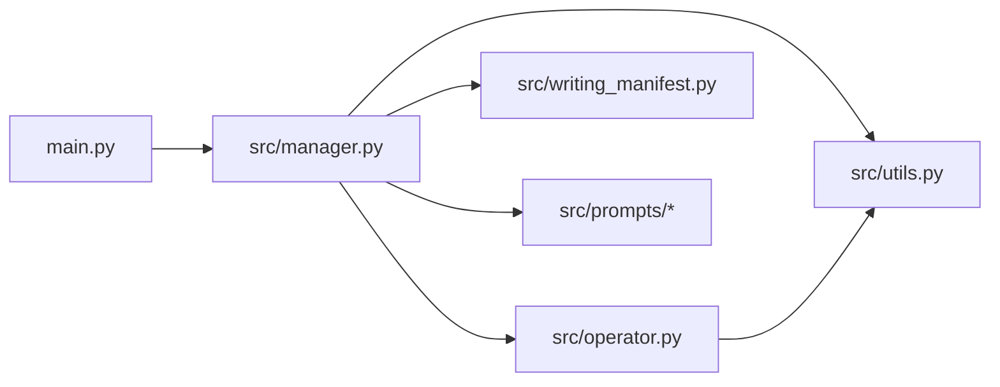
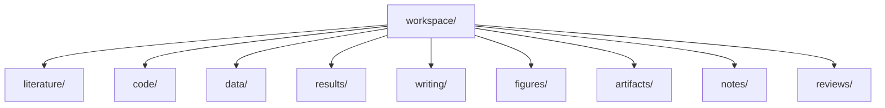

<h1 align="center">AutoR: Accelerating the AI Research Loop with Human-in-the-Loop Co-pilot </h1>

<p align="center">
<b>AI handles the execution load. Humans steer the research direction.</b>
<br />
A terminal-first, 8-stage pipeline that turns high-level goals into verifiable, venue-ready papers.
</p>


<p align="center">
  
  
  
  
  
  
  <a href="https://github.com/HavenIntelligence/AutoR">
    
  </a>
</p>

<p align="center">
  <a href="#-why-autor">Why AutoR</a>
  ·
  <a href="#-showcase">Showcase</a>
  ·
  <a href="#-quick-start">Quick Start</a>
  ·
  <a href="#-how-it-works">How It Works</a>
  ·
  <a href="#-run-layout">Run Layout</a>
  ·
  <a href="#-architecture">Architecture</a>
  ·
  <a href="#-roadmap">Roadmap</a>
</p>

<p align="center">
  
</p>


> AutoR is not a chat demo, not a generic agent framework, and not a markdown-only research toy.
>
> It is a research execution loop:
> **goal -> literature -> hypothesis -> design -> implementation -> experiments -> analysis -> paper -> dissemination**,
> with explicit human control at every stage and real artifacts on disk.

## ✨ Why AutoR

Most AI research demos stop at "the model wrote a plausible summary."

AutoR is built around a harder standard: the system should leave behind a run directory that another person can inspect, resume, audit, and critique.

### What makes it different

| AutoR does | Why it matters |
| --- | --- |
| **Fixed 8-stage research workflow** | The system behaves like a real research process instead of a free-form chat loop. |
| **Mandatory human approval after every stage** | AI executes; humans retain control at high-leverage decision points. |
| **Full run isolation under `runs/<run_id>/`** | Prompts, logs, stage outputs, code, figures, and papers are all auditable. |
| **Draft -> validate -> promote for stage summaries** | Half-finished summaries do not silently become official stage records. |
| **Artifact-aware validation** | Later stages must produce data, results, figures, LaTeX, PDF, and review assets, not just prose. |
| **Resume and redo-stage support** | Long runs are recoverable and partially repeatable. |
| **Stage-local conversation continuation** | Refinement improves the current stage instead of constantly resetting context. |
| **Venue-aware writing stage** | Stage 07 can target lightweight conference or journal-style paper packaging without pretending to be a full submission system. |

### Core guarantees

- A run is isolated under `runs/<run_id>/`.
- Claude never writes directly to the final stage summary file.
- Human approval is required before the workflow advances.
- Approved summaries are appended to `memory.md`; failed attempts are not.
- Stage 03+ must produce machine-readable data artifacts.
- Stage 05+ must produce machine-readable result artifacts.
- Stage 06+ must produce real figure files.
- Stage 07+ must produce a venue-aware manuscript package with a PDF.
- Stage 08+ must produce review and readiness materials.

## 🌟 Showcase

AutoR already has a full example run used throughout the repository: `runs/20260330_101222`.

That run produced:

- a compiled paper PDF: [example_paper.pdf](assets/examples/example_paper.pdf)
- executable research code
- machine-readable datasets and result files
- real figures used in the paper
- review and dissemination materials

Highlighted outcomes from that run:

- `AGSNv2` reached **36.21 ± 1.08** on Actor
- the system produced a full NeurIPS-style paper package
- the final run preserved the full human-in-the-loop approval trail

### Terminal Experience

AutoR is designed for terminal-first execution, but the interaction layer is not limited to raw logs and plain prompts. The current UI supports banner-style startup, colored stage panels, parsed Claude event streams, wrapped markdown summaries, and a menu-driven approval loop suitable for demos and recordings.

<p align="center">
  
</p>

### Example Figures

<table>
  <tr>
    <td align="center" valign="top">
      <strong>Accuracy Comparison</strong><br />
      
    </td>
    <td align="center" valign="top">
      <strong>Ablation + Actor Results</strong><br />
      
    </td>
  </tr>
  <tr>
    <td align="center" valign="top" colspan="2">
      <strong>Two-Layer Narrative Figure</strong><br />
      
    </td>
  </tr>
</table>

### Paper Preview

<table>
  <tr>
    <td align="center" valign="top">
      <strong>Page 1</strong><br />
      Title, abstract, framing<br />
      
    </td>
    <td align="center" valign="top">
      <strong>Page 5</strong><br />
      Method and training algorithm<br />
      
    </td>
    <td align="center" valign="top">
      <strong>Page 7</strong><br />
      Main tables and per-seed results<br />
      
    </td>
  </tr>
</table>

### Human-in-the-Loop in Practice

The example run is interesting not because the AI was left alone, but because the human intervened at critical moments:

- **Stage 02** narrowed the project to a single core claim.
- **Stage 04** pushed the system to download real datasets and run actual pre-checks.
- **Stage 05** forced experimentation to continue until real benchmark results were obtained.
- **Stage 06** redirected the story away from leaderboard-only framing toward mechanism-driven analysis.

That is the intended shape of AutoR:
AI handles execution load; humans steer the research when direction actually matters.

## 🚀 Quick Start

### Prerequisites

- Python 3.10+
- Claude CLI available on `PATH` for real runs
- Local TeX tools are helpful for Stage 07, but not required for smoke tests

### Start a new run

```bash
python main.py
```

### Start with an explicit goal

```bash
python main.py --goal "Your research goal here"
```

### Run a local smoke test without Claude

```bash
python main.py --fake-operator --goal "Smoke test"
```

### Choose a Claude model

```bash
python main.py --model sonnet
python main.py --model opus
```

### Choose a writing venue profile

```bash
python main.py --venue neurips_2025
python main.py --venue nature
python main.py --venue jmlr
```

If `--venue` is omitted, AutoR defaults to `neurips_2025`.

### Resume or redo work inside the same run

```bash
python main.py --resume-run latest
python main.py --resume-run 20260329_210252 --redo-stage 03
```

Valid stage identifiers include `03`, `3`, and `03_study_design`.

## ⚙️ How It Works

AutoR uses a fixed 8-stage pipeline:

1. `01_literature_survey`
2. `02_hypothesis_generation`
3. `03_study_design`
4. `04_implementation`
5. `05_experimentation`
6. `06_analysis`
7. `07_writing`
8. `08_dissemination`



### Stage Attempt Loop



### Approval semantics

- `1 / 2 / 3`: continue the same stage conversation using one of the AI's refinement suggestions
- `4`: continue the same stage conversation with custom user feedback
- `5`: approve and continue to the next stage
- `6`: abort the run

The stage loop is controlled by AutoR, not by Claude.

## ✅ Validation Bar

AutoR does not consider a run successful just because it generated a plausible markdown summary.

| Stage | Required non-toy output |
| --- | --- |
| Stage 03+ | Machine-readable data under `workspace/data/` |
| Stage 05+ | Machine-readable results under `workspace/results/` |
| Stage 06+ | Real figure files under `workspace/figures/` |
| Stage 07+ | Venue-aware manuscript sources plus a compiled PDF |
| Stage 08+ | Review and readiness assets under `workspace/reviews/` |

Required stage summary shape:

```md
# Stage X: <name>

## Objective
## Previously Approved Stage Summaries
## What I Did
## Key Results
## Files Produced
## Suggestions for Refinement
## Your Options
```

Additional rules:

- exactly 3 numbered refinement suggestions
- the fixed 6 user options
- no `[In progress]`, `[Pending]`, `[TODO]`, `[TBD]`, or similar placeholders
- concrete file paths in `Files Produced`

If a run only leaves behind markdown notes, it has not met AutoR's quality bar.

## 📂 Run Layout

Every run lives entirely inside its own directory.

```text
runs/<run_id>/
├── user_input.txt
├── memory.md
├── run_config.json
├── logs.txt
├── logs_raw.jsonl
├── prompt_cache/
├── operator_state/
├── stages/
└── workspace/
    ├── literature/
    ├── code/
    ├── data/
    ├── results/
    ├── writing/
    ├── figures/
    ├── artifacts/
    ├── notes/
    └── reviews/
```

### Directory semantics

- `literature/`: reading notes, survey tables, benchmark notes
- `code/`: runnable code, scripts, configs, implementations
- `data/`: machine-readable data and manifests
- `results/`: machine-readable experiment outputs
- `writing/`: LaTeX sources, sections, bibliography, tables
- `figures/`: real plots and paper figures
- `artifacts/`: compiled PDFs and packaged deliverables
- `notes/`: temporary or supporting research notes
- `reviews/`: readiness, critique, and dissemination materials

## 🧠 Execution Model

For each stage attempt, AutoR assembles a prompt from:

1. the stage template from [src/prompts/](src/prompts)
2. the required stage summary contract
3. execution-discipline constraints
4. `user_input.txt`
5. approved `memory.md`
6. optional refinement feedback
7. for continuation attempts, the current draft/final stage files and workspace context

The assembled prompt is written to `runs/<run_id>/prompt_cache/`, per-stage session IDs are stored in `runs/<run_id>/operator_state/`, and Claude is invoked in live streaming mode.

<details>
<summary><strong>Exact Claude CLI pattern</strong></summary>

First attempt for a stage:

```bash
claude --model <model> \
  --permission-mode bypassPermissions \
  --dangerously-skip-permissions \
  --session-id <stage_session_id> \
  -p @runs/<run_id>/prompt_cache/<stage>_attempt_<nn>.prompt.md \
  --output-format stream-json \
  --verbose
```

Continuation attempt for the same stage:

```bash
claude --model <model> \
  --permission-mode bypassPermissions \
  --dangerously-skip-permissions \
  --resume <stage_session_id> \
  -p @runs/<run_id>/prompt_cache/<stage>_attempt_<nn>.prompt.md \
  --output-format stream-json \
  --verbose
```

</details>

Important behavior:

- refinement attempts reuse the same stage conversation whenever possible
- streamed Claude output is shown live in the terminal
- raw stream-json output is captured in `logs_raw.jsonl`
- if resume fails, AutoR can fall back to a fresh session
- if stage markdown is incomplete, AutoR can repair or normalize it locally

## 🏗️ Architecture

The main code lives in:

- [main.py](main.py)
- [src/manager.py](src/manager.py)
- [src/operator.py](src/operator.py)
- [src/utils.py](src/utils.py)
- [src/writing_manifest.py](src/writing_manifest.py)
- [src/prompts/](src/prompts)



File boundaries:

- [main.py](main.py): CLI entry point. Starts a new run or resumes an existing run.
- [src/manager.py](src/manager.py): Owns the 8-stage loop, approval flow, repair flow, resume, redo-stage logic, and stage-level continuation policy.
- [src/operator.py](src/operator.py): Invokes Claude CLI, streams output live, persists stage session IDs, resumes the same stage conversation for refinement, and falls back to a fresh session if resume fails.
- [src/utils.py](src/utils.py): Stage metadata, prompt assembly, run paths, markdown validation, and artifact validation.
- [src/prompts/](src/prompts): Per-stage prompt templates.

## 📂 Run Layout

Each run contains `user_input.txt`, `memory.md`, `run_manifest.json`, `artifact_index.json`, `prompt_cache/`, `operator_state/`, `stages/`, `workspace/`, `logs.txt`, and `logs_raw.jsonl`. The substantive research payload lives in `workspace/`.



Workspace directories:

- `literature/`: papers, benchmark notes, survey tables, reading artifacts.
- `code/`: runnable pipeline code, scripts, configs, and method implementations.
- `data/`: machine-readable datasets, manifests, processed splits, caches, and loaders.
- `results/`: machine-readable metrics, predictions, ablations, tables, and evaluation outputs.
  AutoR also standardizes `results/experiment_manifest.json` as a machine-readable summary over result, code, and note artifacts for downstream analysis.
- `writing/`: manuscript sources, LaTeX, section drafts, tables, and bibliography.
- `figures/`: plots, diagrams, charts, and paper figures.
- `artifacts/`: compiled PDFs and packaged deliverables.
- `notes/`: temporary notes and setup material.
- `reviews/`: critique notes, threat-to-validity notes, and readiness reviews.

Other run state:

- `memory.md`: approved cross-stage memory only.
- `run_manifest.json`: machine-readable run and stage lifecycle state.
- `artifact_index.json`: machine-readable index over `workspace/data`, `workspace/results`, and `workspace/figures`.
- `prompt_cache/`: exact prompts used for stage attempts and repairs.
- `operator_state/`: per-stage Claude session IDs.
- `stages/`: draft and promoted stage summaries.
- `logs.txt` and `logs_raw.jsonl`: workflow logs and raw Claude stream output.

## ✅ Validation

AutoR validates both the stage markdown and the stage artifacts.

Required stage markdown shape:

```md
# Stage X: <name>

## Objective
## Previously Approved Stage Summaries
## What I Did
## Key Results
## Files Produced
## Suggestions for Refinement
## Your Options
```

Additional markdown requirements:

- Exactly 3 numbered refinement suggestions.
- The fixed 6 user options.
- No unfinished placeholders such as `[In progress]`, `[Pending]`, `[TODO]`, or `[TBD]`.
- Concrete file paths in `Files Produced`.

Artifact requirements by stage:

- Stage 03+: machine-readable data under `workspace/data/`
- Stage 05+: machine-readable results under `workspace/results/`
- Stage 05+: `workspace/results/experiment_manifest.json` must exist and remain structurally valid
- Stage 06+: figure files under `workspace/figures/`
- Stage 07+: venue-aware conference or journal-style LaTeX sources plus a compiled PDF under `workspace/writing/` or `workspace/artifacts/`
- Stage 08+: review and readiness artifacts under `workspace/reviews/`

A run with only markdown notes does not pass validation.

## 📌 Scope

### Included in the current mainline

- fixed 8-stage workflow
- mandatory human approval after every stage
- one primary Claude invocation per stage attempt
- stage-local continuation within the same Claude session
- prompt caching via `@file`
- live streaming terminal output
- repair passes and local fallback normalization
- draft-to-final stage promotion
- artifact-aware validation
- resume and `--redo-stage`
- lightweight venue profiles for Stage 07 writing

### Intentionally out of scope

- generic multi-agent orchestration
- database-backed runtime state
- concurrent stage execution
- heavyweight platform abstractions
- dashboard-first productization

## 🛣️ Roadmap

The most valuable next steps are the ones that make AutoR more like a real research workflow, not more like a demo framework.

- **Cross-stage rollback and invalidation**
  Later-stage failures should be able to mark downstream work as stale.
- **Machine-readable run manifest**
  Add a lightweight source of truth for stage status, stale dependencies, and artifact pointers.
- **Continuation handoff compression**
  Make long stage refinement more stable without bloating context.
- **Stronger automated tests**
  Cover repair flow, resume fallback, artifact validation, and approval-loop correctness.
- **Artifact indexing**
  Add lightweight metadata around `data/`, `results/`, `figures/`, and `writing/`.
- **Frontend run browser**
  A lightweight UI for browsing runs, stages, logs, and artifacts, driven by the run directory itself.

- ~~Stage-local continuation sessions.~~ Keep one Claude conversation per stage, reuse it for `1/2/3/4` refinement, and fall back to a fresh session only when resume fails. This is now implemented in the operator and manager flow.
- ~~Artifact-level validation for non-toy outputs.~~ Enforce machine-readable data, result files, figures, LaTeX sources, PDF output, and review artifacts at the right stages. This is now part of the workflow validation path.
- Cross-stage rollback and invalidation. When a later stage reveals that an earlier design decision is wrong, the workflow should be able to jump back to an earlier stage and mark downstream stages as stale. This is the biggest current control-flow gap.
- Machine-readable run manifest. Add a single source of truth such as `run_manifest.json` to track stage status, approval state, stale dependencies, session IDs, and key artifact pointers. This should make both automation and future UI work much cleaner.
- Continuation handoff compression. Add a short machine-generated stage handoff file that summarizes what is already correct, what is missing, and which files matter most. This should reduce context growth and make continuation more stable over long runs.
- ~~Result schema and artifact indexing.~~ Standardize `workspace/data/`, `workspace/results/`, and `workspace/figures/` around explicit schemas and generate an artifact index automatically. The workflow now writes `artifact_index.json`, carries basic inferred or declared schema metadata, and feeds the index into later-stage prompt context and the writing manifest.
- Writing pipeline hardening. Turn Stage 07 into a reliable manuscript production pipeline with stable conference and journal-style paper structures, bibliography handling, table and figure inclusion, and reproducible PDF compilation. The goal is a submission-ready paper package, not just writing notes.
- Review and dissemination package. Expand Stage 08 so it produces readiness checklists, threats-to-validity notes, artifact manifests, release notes, and external-facing research bundles. The final stage should feel like packaging a paper for real release, not just wrapping up text.
- Frontend run dashboard. Build a lightweight UI that can browse runs, stage status, summaries, logs, artifacts, and validation failures. It should read from the run directory and manifest rather than introducing a database first.
- README and open-source assets. Keep refining the README and add `assets/` images such as workflow diagrams, UI screenshots, and artifact examples. This is important for open-source clarity, onboarding, and project presentation.

## 🌍 Community

Join the project community channels:

| Discord | WeChat | WhatsApp |
| --- | --- | --- |
|  |  |  |

## ⭐ Star History

[](https://star-history.com/#AutoX-AI-Labs/AutoR&Date)
