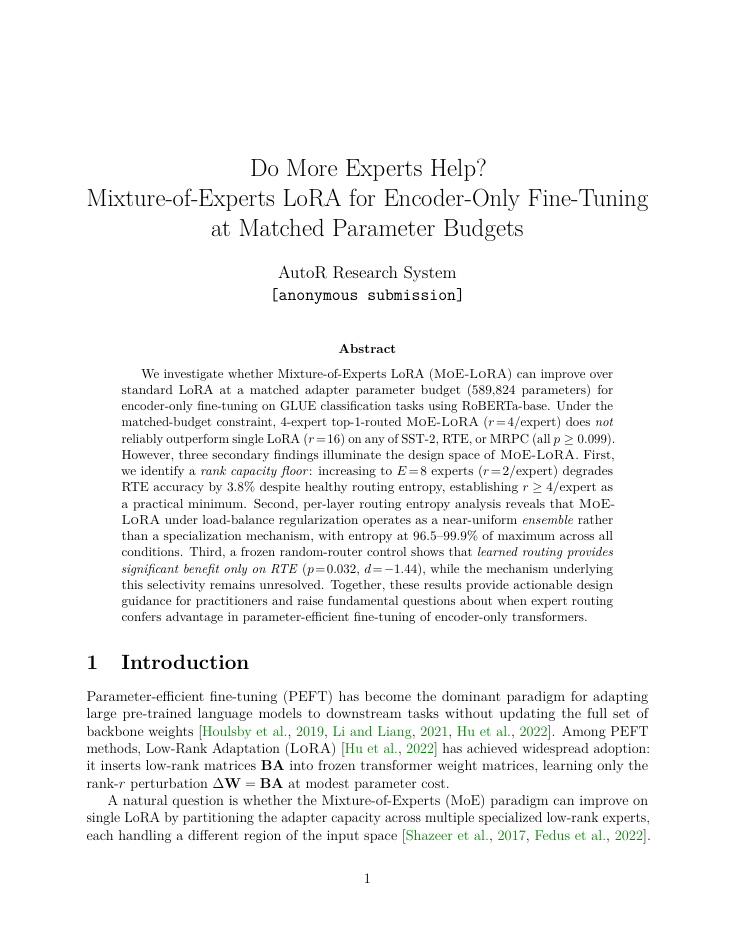
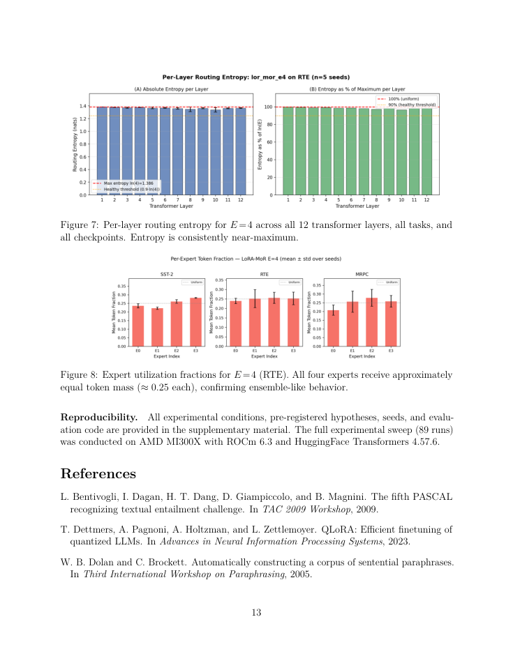
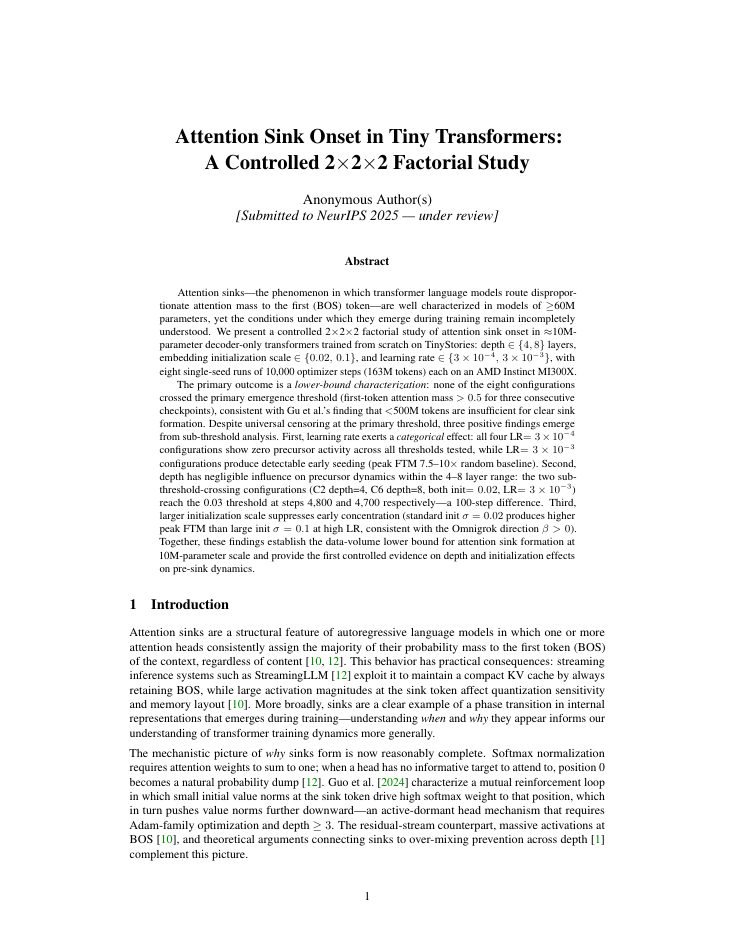
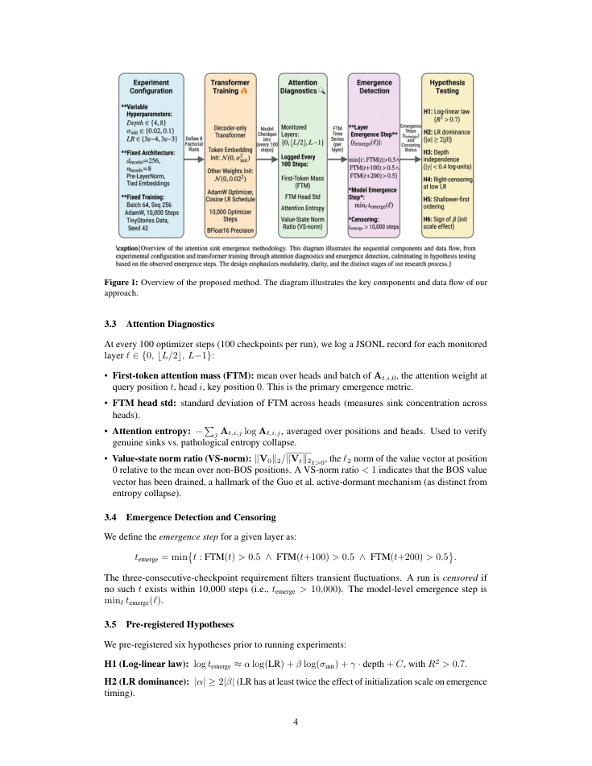
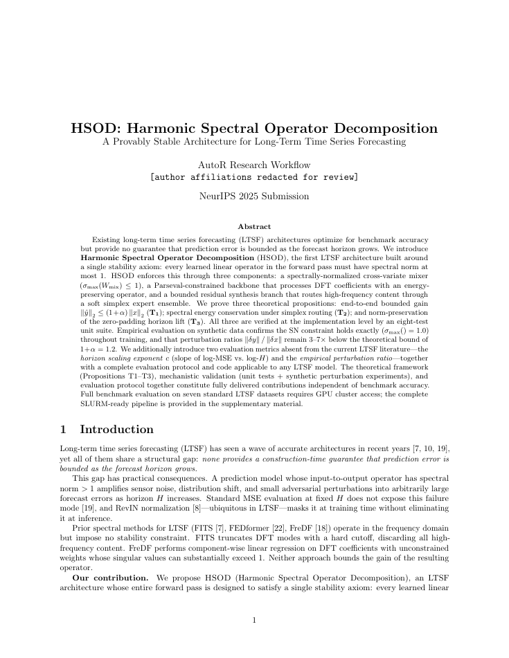
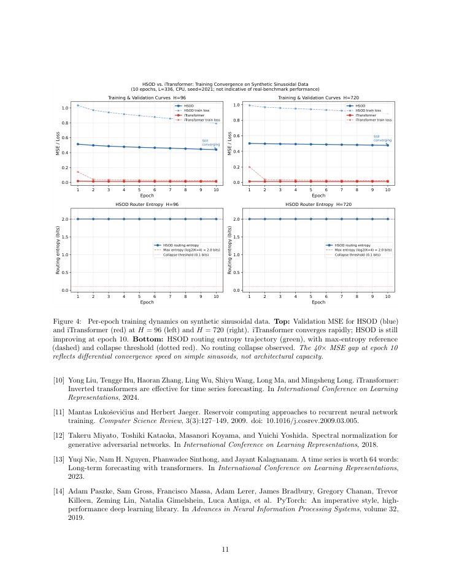
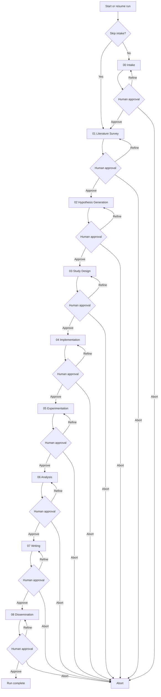
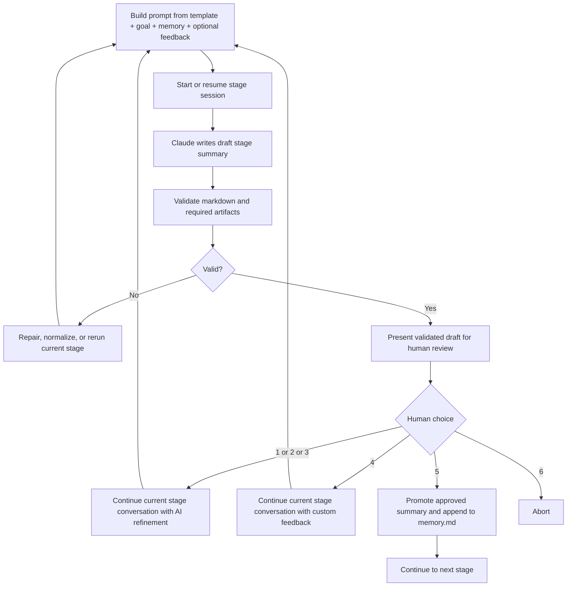
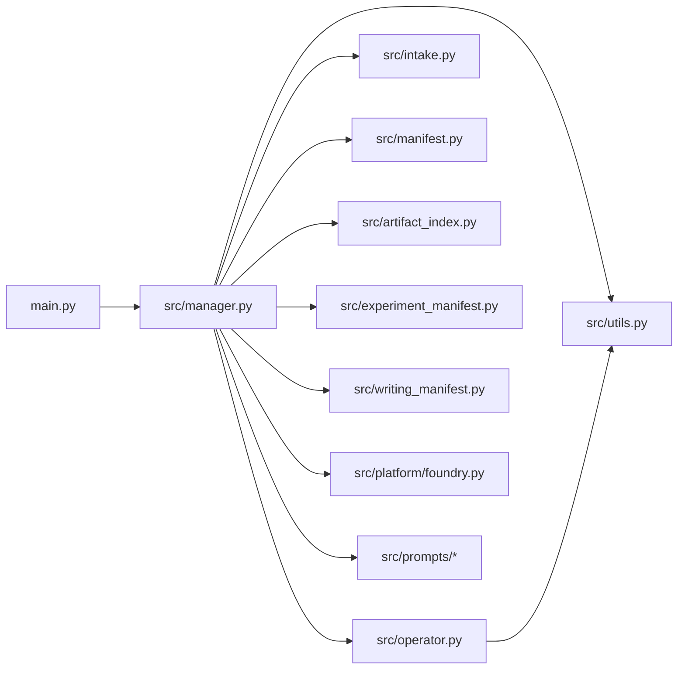
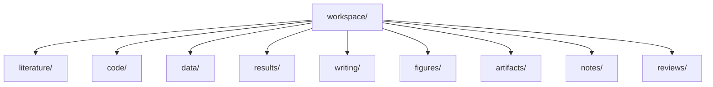

<h1 align="center">AutoR: A Human-Centered Research OS</h1>

<p align="center">
  <strong>AI handles execution. Humans own the direction.</strong>
</p>

<p align="center">
  A terminal-first research harness over Claude Code that turns long, messy research work into reproducible, artifact-backed runs.
</p>

<p align="center">
  
  
  
  
  
  
  <a href="https://github.com/HavenIntelligence/AutoR">
    
  </a>
</p>

<p align="center">
  <a href="#overview">Overview</a>
  ·
  <a href="#-showcase">Showcase</a>
  ·
  <a href="#-quick-start">Quick Start</a>
  ·
  <a href="#-how-it-works">How It Works</a>
  ·
  <a href="#-run-layout">Run Layout</a>
  ·
  <a href="#-architecture">Architecture</a>
  ·
  <a href="#-roadmap">Roadmap</a>
</p>

<p align="center">
  
</p>

---

> AutoR is not a chat demo, not a generic agent framework, and not a markdown-only research toy.
>
> It is a structured research harness over Claude Code:
> **AI handles execution, humans own the direction, and every run becomes an inspectable research artifact on disk.**

## Overview

Most autoresearch systems optimize for autonomy.

AutoR takes a different position: research is too important to hand over as a blind end-to-end loop. The goal is not to remove humans from research. The goal is to give them a stronger execution system.

### At a Glance

| Dimension | AutoR |
| --- | --- |
| Execution model | Claude Code as the execution layer, AutoR as the research control loop |
| Control model | Human approval required after every stage |
| Research unit | A reproducible run under `runs/<run_id>/` |
| Workflow shape | Optional intake plus a fixed 8-stage pipeline |
| Quality bar | Artifact-backed outputs, not markdown-only summaries |
| Recovery | Resume, redo-stage, rollback-stage, stage-local continuation |

### Highlights

| Commitment | Why it matters |
| --- | --- |
| **Human-centered research execution** | AutoR is not an autonomous scientist. AI handles execution; humans own the direction at every stage boundary. |
| **A research harness over Claude Code** | AutoR does not reinvent the coding agent. It constrains, validates, and operationalizes Claude Code inside a real research workflow. |
| **Every run is a reproducible research artifact** | A run leaves behind prompts, logs, stage summaries, code, data, results, figures, paper sources, and approval trail under `runs/<run_id>/`. |
| **Verifiable outputs, not paper-shaped theater** | AutoR does not ask "does this look conference-ready?" It asks "can you verify every claim with artifacts?" |

### What AutoR Guarantees

- Human approval is required before the workflow advances.
- Approved summaries become the only cross-stage memory.
- Every run is isolated, resumable, and auditable.
- Later stages must produce real artifacts, not only prose.
- Claude Code is the execution layer; AutoR is the research control loop above it.

### Why AutoR?

Many systems aim to generate papers that *look* ready.

AutoR takes a harder path:

- it requires real experiments
- it enforces artifact validation
- it keeps humans in control

So the question is not:

> Does it look ready?

It is:

> Can you verify every part of it?

## 🌟 Showcase

AutoR already has a full example run used throughout the repository: `runs/20260330_101222`.

### Example Run Snapshot

| What the run produced | What it demonstrates |
| --- | --- |
| [example_paper.pdf](assets/examples/example_paper.pdf) | A full compiled paper artifact |
| Executable research code | The run is not just a writing pipeline |
| Machine-readable datasets and result files | Claims are backed by inspectable experiment outputs |
| Real figures used in the paper | The run produces publication-style visuals, not placeholders |
| Review and dissemination materials | The workflow continues past writing into release readiness |

Highlighted outcomes from that run:

- `AGSNv2` reached **36.21 ± 1.08** on Actor.
- The system produced a full manuscript package with real figures and artifacts.
- The final run preserved the full human-in-the-loop approval trail.

### Terminal Experience

AutoR is designed for terminal-first execution, but the interaction layer is not limited to raw logs and plain prompts. The current UI supports banner-style startup, colored stage panels, parsed Claude event streams, wrapped markdown summaries, and a menu-driven approval loop suitable for demos and recordings.

<p align="center">
  
</p>

### Example Figures

<table>
  <tr>
    <td align="center" valign="top">
      <strong>Accuracy Comparison</strong><br />
      
    </td>
    <td align="center" valign="top">
      <strong>Ablation + Actor Results</strong><br />
      
    </td>
  </tr>
  <tr>
    <td align="center" valign="top" colspan="2">
      <strong>Two-Layer Narrative Figure</strong><br />
      
    </td>
  </tr>
</table>

### Paper Gallery

AutoR already has a growing set of full-paper outputs. Instead of showing a single preview page in isolation, the gallery below uses a consistent 4 × 2 layout: four papers, two representative pages from each, with a short note on what each manuscript is demonstrating.

<table>
  <tr>
    <td valign="top" width="23%">
      <strong>Paper 1</strong><br />
      A complete end-to-end AutoR manuscript. The pair below shows the opening framing page and a later quantitative page with the main tables.
    </td>
    <td align="center" valign="top">
      <br />
      <strong>Page 1</strong>
    </td>
    <td align="center" valign="top">
      <br />
      <strong>Results Page</strong>
    </td>
  </tr>
  <tr>
    <td valign="top" width="23%">
      <strong>Paper 2</strong><br />
      <em>Do More Experts Help?</em> A parameter-matched MoE-LoRA study. The selected pages show the manuscript framing and a result page with comparative bar charts.
    </td>
    <td align="center" valign="top">
      <br />
      <strong>Page 1</strong>
    </td>
    <td align="center" valign="top">
      <br />
      <strong>Results Page</strong>
    </td>
  </tr>
  <tr>
    <td valign="top" width="23%">
      <strong>Paper 3</strong><br />
      <em>Attention Sink Onset in Tiny Transformers</em> A controlled factorial study. The chosen pages show the opening page and a later system-overview page with structured visual decomposition.
    </td>
    <td align="center" valign="top">
      <br />
      <strong>Page 1</strong>
    </td>
    <td align="center" valign="top">
      <br />
      <strong>Overview Page</strong>
    </td>
  </tr>
  <tr>
    <td valign="top" width="23%">
      <strong>Paper 4</strong><br />
      <em>HSOD: Harmonic Spectral Operator Decomposition</em> A stability-focused time-series paper. The pair below shows the framing page and a later page with dense training-dynamics plots.
    </td>
    <td align="center" valign="top">
      <br />
      <strong>Page 1</strong>
    </td>
    <td align="center" valign="top">
      <br />
      <strong>Analysis Page</strong>
    </td>
  </tr>
</table>

### Human-in-the-Loop in Practice

The example run is interesting not because the AI was left alone, but because the human intervened at critical moments:

- **Stage 02** narrowed the project to a single core claim.
- **Stage 04** pushed the system to download real datasets and run actual pre-checks.
- **Stage 05** forced experimentation to continue until real benchmark results were obtained.
- **Stage 06** redirected the story away from leaderboard-only framing toward mechanism-driven analysis.

That is the intended shape of AutoR:
AI handles execution load; humans steer the research when direction actually matters.

## 🚀 Quick Start

### Prerequisites

- Python 3.10+
- Claude CLI available on `PATH` for real runs
- Local TeX tools are helpful for Stage 07, but not required for smoke tests

### Common Commands

| Goal | Command |
| --- | --- |
| Start a new run | `python main.py` |
| Start with an explicit goal | `python main.py --goal "Your research goal here"` |
| Start with preloaded resources | `python main.py --goal "Your research goal here" --resources paper.pdf refs.bib data.csv` |
| Run a local smoke test without Claude | `python main.py --fake-operator --goal "Smoke test"` |
| Choose a Claude model | `python main.py --model sonnet` or `python main.py --model opus` |
| Choose a writing venue profile | `python main.py --venue neurips_2025` or `python main.py --venue nature` or `python main.py --venue jmlr` |
| Resume the latest run | `python main.py --resume-run latest` |
| Redo a stage inside the same run | `python main.py --resume-run 20260329_210252 --redo-stage 03` |
| Roll back to a stage inside the same run | `python main.py --resume-run 20260329_210252 --rollback-stage 03` |

If `--venue` is omitted, AutoR defaults to `neurips_2025`.

Valid stage identifiers include `03`, `3`, and `03_study_design`.

## ⚙️ How It Works

AutoR uses an optional intake step followed by a fixed 8-stage pipeline:

0. `00_intake` (optional)

1. `01_literature_survey`
2. `02_hypothesis_generation`
3. `03_study_design`
4. `04_implementation`
5. `05_experimentation`
6. `06_analysis`
7. `07_writing`
8. `08_dissemination`



### Stage Attempt Loop



### Approval semantics

- `1 / 2 / 3`: continue the same stage conversation using one of the AI's refinement suggestions
- `4`: continue the same stage conversation with custom user feedback
- `5`: approve and continue to the next stage
- `6`: abort the run

The stage loop is controlled by AutoR, not by Claude.

## ✅ Validation Bar

AutoR does not consider a run successful just because it generated a plausible markdown summary.

| Stage | Required non-toy output |
| --- | --- |
| Stage 03+ | Machine-readable data under `workspace/data/` |
| Stage 05+ | Machine-readable results under `workspace/results/` |
| Stage 06+ | Real figure files under `workspace/figures/` |
| Stage 07+ | Manuscript sources plus a compiled PDF |
| Stage 08+ | Review and readiness assets under `workspace/reviews/` |

Required stage summary shape:

```md
# Stage X: <name>

## Objective
## Previously Approved Stage Summaries
## What I Did
## Key Results
## Files Produced
## Suggestions for Refinement
## Your Options
```

Additional rules:

- exactly 3 numbered refinement suggestions
- the fixed 6 user options
- no `[In progress]`, `[Pending]`, `[TODO]`, `[TBD]`, or similar placeholders
- concrete file paths in `Files Produced`

If a run only leaves behind markdown notes, it has not met AutoR's quality bar.

## 📂 Run Layout

Every run lives entirely inside its own directory.

```text
runs/<run_id>/
├── user_input.txt
├── memory.md
├── run_config.json
├── run_manifest.json
├── artifact_index.json
├── intake_context.json
├── logs.txt
├── logs_raw.jsonl
├── prompt_cache/
├── operator_state/
├── handoff/
├── stages/
└── workspace/
    ├── literature/
    ├── code/
    ├── data/
    ├── results/
    ├── writing/
    ├── figures/
    ├── artifacts/
    ├── notes/
    └── reviews/
```

### Workspace Directory Semantics

- `literature/`: reading notes, survey tables, benchmark notes
- `code/`: runnable code, scripts, configs, implementations
- `data/`: machine-readable data and manifests
- `results/`: machine-readable experiment outputs
- `writing/`: LaTeX sources, sections, bibliography, tables
- `figures/`: real plots and paper figures
- `artifacts/`: compiled PDFs and packaged deliverables
- `notes/`: temporary or supporting research notes
- `reviews/`: readiness, critique, and dissemination materials

## 🧠 Execution Model

For each stage attempt, AutoR assembles a prompt from:

1. the stage template from [src/prompts/](src/prompts)
2. the required stage summary contract
3. execution-discipline constraints
4. `user_input.txt`
5. approved `memory.md`
6. `intake_context.json`, `artifact_index.json`, and, when available, `experiment_manifest.json`
7. optional refinement feedback
8. for continuation attempts, the current draft/final stage files and workspace context

The assembled prompt is written to `runs/<run_id>/prompt_cache/`, per-stage session IDs are stored in `runs/<run_id>/operator_state/`, and Claude is invoked in live streaming mode.

<details>
<summary><strong>Exact Claude CLI pattern</strong></summary>

First attempt for a stage:

```bash
claude --model <model> \
  --permission-mode bypassPermissions \
  --dangerously-skip-permissions \
  --session-id <stage_session_id> \
  -p @runs/<run_id>/prompt_cache/<stage>_attempt_<nn>.prompt.md \
  --output-format stream-json \
  --verbose
```

Continuation attempt for the same stage:

```bash
claude --model <model> \
  --permission-mode bypassPermissions \
  --dangerously-skip-permissions \
  --resume <stage_session_id> \
  -p @runs/<run_id>/prompt_cache/<stage>_attempt_<nn>.prompt.md \
  --output-format stream-json \
  --verbose
```

</details>

Important behavior:

- refinement attempts reuse the same stage conversation whenever possible
- streamed Claude output is shown live in the terminal
- raw stream-json output is captured in `logs_raw.jsonl`
- if resume fails, AutoR can fall back to a fresh session
- if stage markdown is incomplete, AutoR can repair or normalize it locally

## 🏗️ Architecture

The main code lives in:

- [main.py](main.py)
- [src/manager.py](src/manager.py)
- [src/operator.py](src/operator.py)
- [src/intake.py](src/intake.py)
- [src/manifest.py](src/manifest.py)
- [src/artifact_index.py](src/artifact_index.py)
- [src/experiment_manifest.py](src/experiment_manifest.py)
- [src/utils.py](src/utils.py)
- [src/writing_manifest.py](src/writing_manifest.py)
- [src/platform/foundry.py](src/platform/foundry.py)
- [src/prompts/](src/prompts)



File boundaries:

- [main.py](main.py): CLI entry point. Starts a new run, resumes an existing run, collects resources, and exposes redo/rollback controls.
- [src/manager.py](src/manager.py): Owns intake plus the 8-stage loop, approval flow, repair flow, resume/redo/rollback logic, and stage-level continuation policy.
- [src/operator.py](src/operator.py): Invokes Claude CLI, streams output live, persists stage session state, resumes the same stage conversation for refinement, and falls back to a fresh session if resume fails.
- [src/intake.py](src/intake.py): Resource ingestion, intake context persistence, and prompt formatting for preloaded materials.
- [src/manifest.py](src/manifest.py): Lightweight run lifecycle state, stage status tracking, and rollback/stale invalidation.
- [src/artifact_index.py](src/artifact_index.py): Run-wide artifact indexing over data, results, and figures.
- [src/experiment_manifest.py](src/experiment_manifest.py): Standardized experiment bundle summary used by later stages.
- [src/utils.py](src/utils.py): Stage metadata, prompt assembly, run paths, markdown validation, artifact validation, and handoff helpers.
- [src/prompts/](src/prompts): Per-stage prompt templates.

## 🗂️ Run State

Each run contains `user_input.txt`, `memory.md`, `run_manifest.json`, `artifact_index.json`, `prompt_cache/`, `operator_state/`, `stages/`, `workspace/`, `logs.txt`, and `logs_raw.jsonl`. The substantive research payload lives in `workspace/`.



Workspace directories:

- `literature/`: papers, benchmark notes, survey tables, reading artifacts.
- `code/`: runnable pipeline code, scripts, configs, and method implementations.
- `data/`: machine-readable datasets, manifests, processed splits, caches, and loaders.
- `results/`: machine-readable metrics, predictions, ablations, tables, and evaluation outputs.
  AutoR also standardizes `results/experiment_manifest.json` as a machine-readable summary over result, code, and note artifacts for downstream analysis.
- `writing/`: manuscript sources, LaTeX, section drafts, tables, and bibliography.
- `figures/`: plots, diagrams, charts, and paper figures.
- `artifacts/`: compiled PDFs and packaged deliverables.
- `notes/`: temporary notes and setup material.
- `reviews/`: critique notes, threat-to-validity notes, and readiness reviews.

Other run state:

- `memory.md`: approved cross-stage memory only.
- `run_manifest.json`: machine-readable run and stage lifecycle state.
- `artifact_index.json`: machine-readable index over `workspace/data`, `workspace/results`, and `workspace/figures`.
- `prompt_cache/`: exact prompts used for stage attempts and repairs.
- `operator_state/`: per-stage Claude session IDs.
- `stages/`: draft and promoted stage summaries.
- `logs.txt` and `logs_raw.jsonl`: workflow logs and raw Claude stream output.

## ✅ Validation

AutoR validates both the stage markdown and the stage artifacts.

Required stage markdown shape:

```md
# Stage X: <name>

## Objective
## Previously Approved Stage Summaries
## What I Did
## Key Results
## Files Produced
## Suggestions for Refinement
## Your Options
```

Additional markdown requirements:

- Exactly 3 numbered refinement suggestions.
- The fixed 6 user options.
- No unfinished placeholders such as `[In progress]`, `[Pending]`, `[TODO]`, or `[TBD]`.
- Concrete file paths in `Files Produced`.

Artifact requirements by stage:

- Stage 03+: machine-readable data under `workspace/data/`
- Stage 05+: machine-readable results under `workspace/results/`
- Stage 05+: `workspace/results/experiment_manifest.json` must exist and remain structurally valid
- Stage 06+: figure files under `workspace/figures/`
- Stage 07+: venue-aware conference or journal-style LaTeX sources plus a compiled PDF under `workspace/writing/` or `workspace/artifacts/`
- Stage 08+: review and readiness artifacts under `workspace/reviews/`

A run with only markdown notes does not pass validation.

## 📌 Scope

### Included in the current mainline

- optional intake stage and resource ingestion
- fixed 8-stage workflow
- mandatory human approval after every stage
- Claude Code as the execution layer
- stage-local continuation within the same Claude session
- prompt caching via `@file`
- live streaming terminal output
- repair passes and local fallback normalization
- run manifest, rollback, and stale tracking
- artifact index and experiment manifest
- stage handoff context
- paper/release package generation after approval
- artifact-aware validation
- resume, `--redo-stage`, and `--rollback-stage`
- lightweight venue profiles for Stage 07 writing

### Intentionally out of scope

- generic multi-agent orchestration
- database-backed runtime state
- concurrent stage execution
- heavyweight platform abstractions
- dashboard-first productization

## 🛣️ Roadmap

The most valuable next steps are the ones that make AutoR more like a real research workflow, not more like a demo framework.

| Next step | Why it matters |
| --- | --- |
| **Deeper cross-stage rollback and invalidation** | Make downstream stale-state handling stronger and more explicit after earlier-stage changes. |
| **Stronger machine-readable run state** | Extend the current run manifest into a better source of truth for stage status, stale dependencies, and artifact pointers. |
| **Continuation handoff compression** | Make long stage refinement more stable without bloating context. |
| **Stronger automated tests** | Cover repair flow, resume fallback, artifact validation, and approval-loop correctness more deeply. |
| **Richer artifact indexing** | Extend metadata around `data/`, `results/`, `figures/`, and `writing/` without turning AutoR into a heavy platform. |
| **Frontend run browser** | Add a lightweight UI for browsing runs, stages, logs, and artifacts directly from the run directory. |

Implemented milestone:

- ~~Stage-local continuation sessions.~~ Keep one Claude conversation per stage, reuse it for `1/2/3/4` refinement, and fall back to a fresh session only when resume fails. This is now implemented in the operator and manager flow.
- ~~Artifact-level validation for non-toy outputs.~~ Enforce machine-readable data, result files, figures, LaTeX sources, PDF output, and review artifacts at the right stages. This is now part of the workflow validation path.

<details>
<summary><strong>Expanded roadmap notes</strong></summary>

- Cross-stage rollback and invalidation. When a later stage reveals that an earlier design decision is wrong, the workflow should be able to jump back to an earlier stage and mark downstream stages as stale. This is the biggest current control-flow gap.
- Machine-readable run manifest. Add a single source of truth such as `run_manifest.json` to track stage status, approval state, stale dependencies, session IDs, and key artifact pointers. This should make both automation and future UI work much cleaner.
- Continuation handoff compression. Add a short machine-generated stage handoff file that summarizes what is already correct, what is missing, and which files matter most. This should reduce context growth and make continuation more stable over long runs.
- ~~Result schema and artifact indexing.~~ Standardize `workspace/data/`, `workspace/results/`, and `workspace/figures/` around explicit schemas and generate an artifact index automatically. The workflow now writes `artifact_index.json`, carries basic inferred or declared schema metadata, and feeds the index into later-stage prompt context and the writing manifest.
- Writing pipeline hardening. Turn Stage 07 into a reliable manuscript production pipeline with stable conference and journal-style paper structures, bibliography handling, table and figure inclusion, and reproducible PDF compilation. The goal is a submission-ready paper package, not just writing notes.
- Review and dissemination package. Expand Stage 08 so it produces readiness checklists, threats-to-validity notes, artifact manifests, release notes, and external-facing research bundles. The final stage should feel like packaging a paper for real release, not just wrapping up text.
- Frontend run dashboard. Build a lightweight UI that can browse runs, stage status, summaries, logs, artifacts, and validation failures. It should read from the run directory and manifest rather than introducing a database first.
- README and open-source assets. Keep refining the README and add `assets/` images such as workflow diagrams, UI screenshots, and artifact examples. This is important for open-source clarity, onboarding, and project presentation.

</details>

## 🌍 Community

Join the project community channels:

| Discord | WeChat | WhatsApp |
| --- | --- | --- |
|  |  |  |

## ⭐ Star History

[](https://star-history.com/#AutoX-AI-Labs/AutoR&Date)
