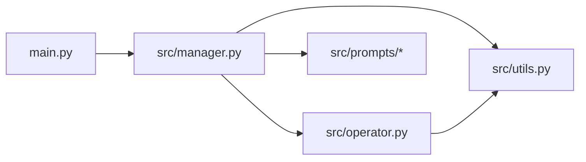
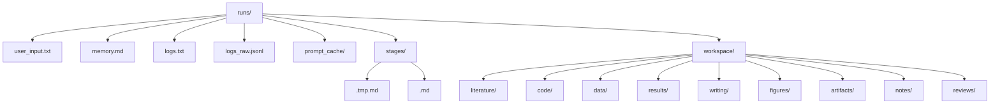
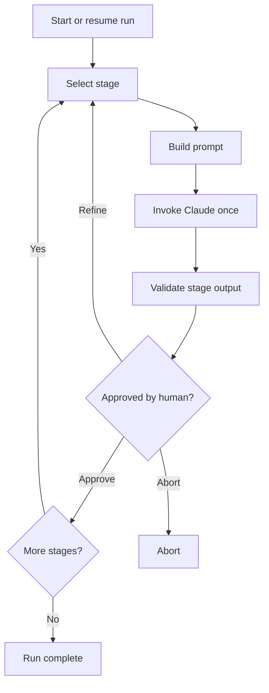
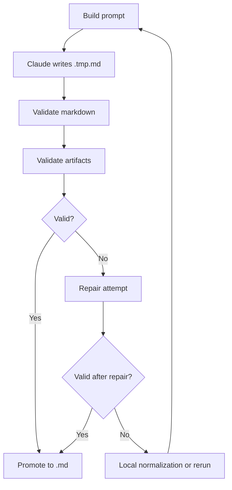

# AutoR

AutoR is a terminal-first, file-based research workflow runner. A user gives a research goal, AutoR executes a fixed 8-stage pipeline with Claude Code, and every stage must be explicitly approved by a human before the workflow can continue.

The system is built around durable run directories, strict human approval, and concrete research artifacts rather than text-only summaries.

## What It Is

AutoR runs these fixed stages:

1. `01_literature_survey`
2. `02_hypothesis_generation`
3. `03_study_design`
4. `04_implementation`
5. `05_experimentation`
6. `06_analysis`
7. `07_writing`
8. `08_dissemination`

Each stage attempt:

- builds a prompt from the stage template, user goal, approved memory, and optional revision feedback
- invokes Claude exactly once
- writes a stage draft to `stages/<stage>.tmp.md`
- validates summary structure and artifact requirements
- promotes the validated draft to `stages/<stage>.md`
- waits for explicit human approval

## Code Structure

Key files:

- [main.py](/mnt/d/xwh/ailab记录/工作/26年04月/AutoR/main.py)
- [src/manager.py](/mnt/d/xwh/ailab记录/工作/26年04月/AutoR/src/manager.py)
- [src/operator.py](/mnt/d/xwh/ailab记录/工作/26年04月/AutoR/src/operator.py)
- [src/utils.py](/mnt/d/xwh/ailab记录/工作/26年04月/AutoR/src/utils.py)
- [src/prompts/](/mnt/d/xwh/ailab记录/工作/26年04月/AutoR/src/prompts)



Module roles:

- [main.py](/mnt/d/xwh/ailab记录/工作/26年04月/AutoR/main.py)
  - CLI entry point
  - starts a new run or resumes an existing run
- [src/manager.py](/mnt/d/xwh/ailab记录/工作/26年04月/AutoR/src/manager.py)
  - owns the stage loop
  - handles repair, promotion, approval, and resume logic
- [src/operator.py](/mnt/d/xwh/ailab记录/工作/26年04月/AutoR/src/operator.py)
  - invokes Claude CLI
  - streams output live
  - runs repair prompts
- [src/utils.py](/mnt/d/xwh/ailab记录/工作/26年04月/AutoR/src/utils.py)
  - stage metadata
  - run paths
  - prompt assembly
  - markdown validation
  - artifact validation

## Run Structure

Each run lives under `runs/<run_id>/`.



Meaning:

- `user_input.txt`
  - original user goal
- `memory.md`
  - approved cross-stage context only
- `prompt_cache/`
  - exact prompts used for attempts and repairs
- `stages/<stage>.tmp.md`
  - current attempt draft
- `stages/<stage>.md`
  - validated final stage summary
- `workspace/`
  - substantive research artifacts

## Workflow

This is the full 8-stage control loop.



## Stage Attempt Loop

This is the internal loop for a single stage.



Rules:

- Claude never writes directly to the final stage file.
- The final stage file is only created after validation.
- Invalid stages do not advance.
- Human approval is the only path to the next stage.

## Prompt and Execution Model

For each stage attempt, AutoR builds a prompt from:

1. the stage template
2. the required stage summary format
3. execution discipline
4. `user_input.txt`
5. `memory.md`
6. optional revision feedback

Claude is invoked through [src/operator.py](/mnt/d/xwh/ailab记录/工作/26年04月/AutoR/src/operator.py) in streaming mode using a cached prompt file.

Current invocation shape:

```bash
claude --model <model> \
  --permission-mode bypassPermissions \
  --dangerously-skip-permissions \
  -p @runs/<run_id>/prompt_cache/<stage>_attempt_<nn>.prompt.md \
  --output-format stream-json \
  --verbose
```

## Human Review Loop

After a validated stage summary is displayed, AutoR accepts:

- `1`, `2`, `3`
  - rerun the current stage using the corresponding AI refinement suggestion
- `4`
  - rerun the current stage using custom user feedback
- `5`
  - approve the stage and append its approved summary to `memory.md`
- `6`
  - abort immediately

Only `5` may advance to the next stage.

## Resume and Redo

Resume the latest run:

```bash
python main.py --resume-run latest
```

Resume a specific run:

```bash
python main.py --resume-run 20260329_210252
```

Redo from a specific stage inside the same run:

```bash
python main.py --resume-run 20260329_210252 --redo-stage 03
```

Valid stage identifiers include:

- `03`
- `3`
- `03_study_design`

Resume logic is implemented in [main.py](/mnt/d/xwh/ailab记录/工作/26年04月/AutoR/main.py) and [src/manager.py](/mnt/d/xwh/ailab记录/工作/26年04月/AutoR/src/manager.py).

## Validation

AutoR validates both stage summaries and stage artifacts.

### Stage Summary Requirements

Each stage summary must contain:

```md
# Stage X: <name>

## Objective
## Previously Approved Stage Summaries
## What I Did
## Key Results
## Files Produced
## Suggestions for Refinement
## Your Options
```

It must also:

- contain 3 numbered refinement suggestions
- contain the fixed 6 user options
- avoid unfinished placeholders such as `[In progress]`, `[Pending]`, `[TODO]`
- list concrete file paths in `Files Produced`

### Artifact Requirements

Beyond markdown, later stages must produce concrete artifacts:

- Stage 03+
  - machine-readable data under `workspace/data/`
- Stage 05+
  - machine-readable results under `workspace/results/`
- Stage 06+
  - figure files under `workspace/figures/`
- Stage 07+
  - NeurIPS-style LaTeX sources under `workspace/writing/`
  - compiled PDF under `workspace/writing/` or `workspace/artifacts/`
- Stage 08+
  - review/readiness artifacts under `workspace/reviews/`

This is intentional. A run with only markdown notes is not treated as a serious completed research package.

## CLI

Start a new run:

```bash
python main.py
```

Start a new run with an inline goal:

```bash
python main.py --goal "Your research goal here"
```

Run fake mode:

```bash
python main.py --fake-operator --goal "Smoke test"
```

## Scope

Included:

- fixed 8-stage workflow
- one Claude invocation per stage attempt
- mandatory human approval after every stage
- AI refine / custom refine / approve / abort
- isolated run directories
- streaming Claude output
- repair passes
- draft-to-final stage promotion
- resume and redo-stage support
- artifact-level validation

Out of scope:

- multi-agent orchestration
- database-backed state
- web UI
- concurrent stage execution
- automatic reviewer scoring

## Notes

- `runs/` is gitignored.
- The workflow control layer is implemented; submission-grade output still depends on the available environment, data access, model access, and the quality of the stage attempts.
