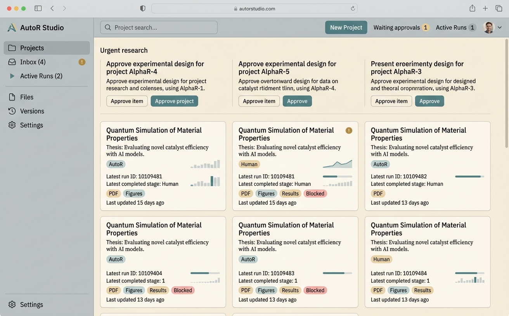
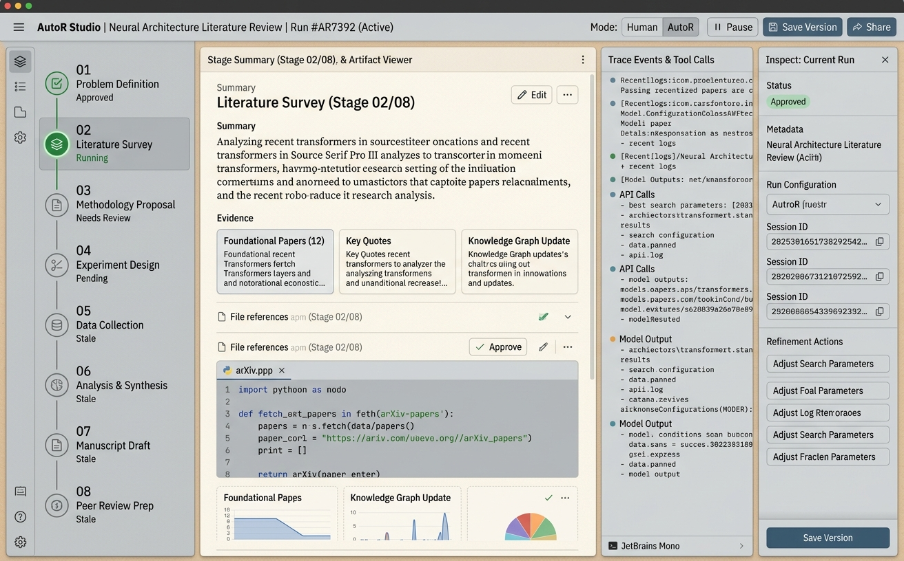
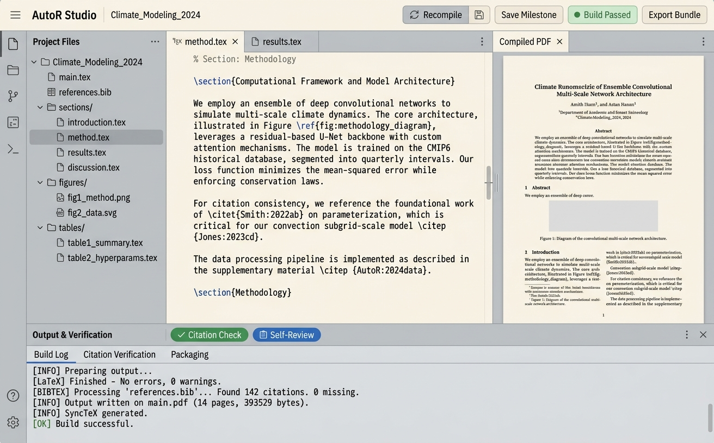
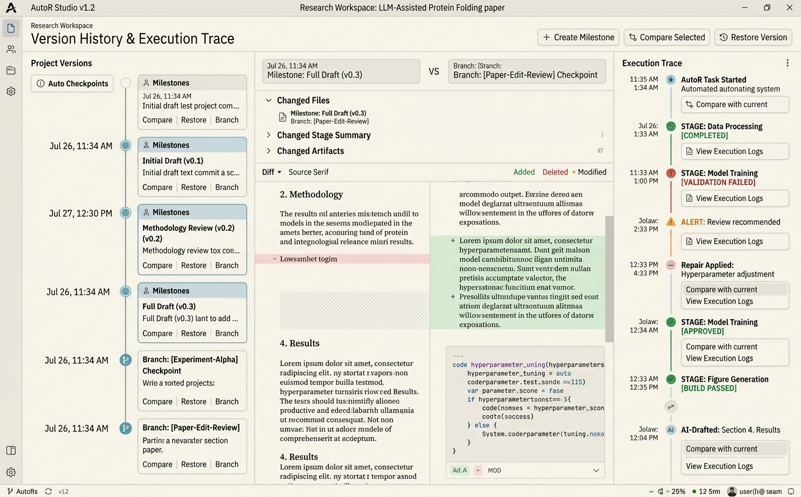

# AutoR UI Initial Design

This folder contains the first UI design pass for a graphical AutoR product that stays faithful to the current codebase.

The design direction is intentionally practical:

- calm, clear, and dense enough for serious research work
- better at project control and artifact inspection than at visual spectacle
- familiar where needed, borrowing the good parts of Overleaf, VS Code, Linear, Cursor, and NotebookLM
- optimized for long-running research workflows with human checkpoints

## What Exists In The Current Codebase

The design is grounded in real repository concepts, not imaginary product objects.

| Current source of truth | What it means in product terms | Proposed UI surface |
| --- | --- | --- |
| `runs/<run_id>/run_manifest.json` | run status, stage state, attempts, approvals, stale/dirty state | stage rail, run overview, project dashboard |
| `runs/<run_id>/stages/*.md` | approved stage summaries | stage summary reader, review mode, version compare |
| `runs/<run_id>/logs.txt` and `logs_raw.jsonl` | human-readable logs and event stream | trace timeline, debug console, event inspector |
| `runs/<run_id>/operator_state/*` | session IDs, attempts, recovery state | execution metadata drawer |
| `runs/<run_id>/artifact_index.json` | structured data, result, and figure inventory | artifact explorer, evidence browser |
| `runs/<run_id>/workspace/` | the actual research payload | file tree, editor, previews |
| `runs/<run_id>/workspace/writing/main.tex` and `main.pdf` | manuscript source and compiled output | Overleaf-style writing studio |
| `runs/<run_id>/memory.md` and `handoff/*.md` | cross-stage memory and handoff | context panel, provenance panel |

## Product Thesis

AutoR should feel like a research operating system, not a chat window with extra tabs.

The core UX unit should become:

`Project -> Run -> Stage -> Artifact -> Version`

Not:

`Chat -> Chat -> More Chat`

That change matters because AutoR already stores durable state on disk. The UI should expose that structure directly.

## Primary Users

- a researcher running several experiments or paper efforts at once
- a human supervisor steering a long AutoR run with stage-by-stage approval
- a writing-heavy user who needs LaTeX source, compiled PDF, build logs, and evidence side by side

## Initial Scope

This first design pass covers the features you requested:

- multiple research project management
- `Human` and `AutoR` interaction modes
- traceable execution history
- reload and recovery
- labeled saved versions
- partial iteration on a selected stage or section
- Overleaf-style LaTeX compile plus PDF display
- VS Code-style file and artifact exploration

## Visual Direction

**Working name:** `AutoR Studio`

**Mood:** calm lab notebook plus modern IDE

**Not fancy:** no glossy gradients everywhere, no dashboard theater, no loud neon

**Style tokens**

- Background: warm paper `#F6F2EA`
- Surface: cool mist `#EEF3F6`
- Card: `#FBFCFD`
- Ink: `#18222D`
- Muted text: `#5B6875`
- Accent: deep teal `#1F7A6A`
- Warning: brass `#B9822E`
- Error: oxide `#C65A46`
- Divider: `#D8E0E7`

**Typography**

- UI: IBM Plex Sans
- Reading panes: Source Serif 4
- Code and logs: JetBrains Mono

## Prototype Gallery

These prototypes are intended as visual mood boards and layout references, not final pixel-perfect screens.
They were generated locally on April 9, 2026 with Gemini image models, so the layout and visual hierarchy are meaningful but some small text inside the mockups is illustrative only.

### 1. Project Hub



What this screen solves:

- manage many research efforts at once
- see active run status immediately
- jump into paused or blocked work
- separate projects from individual runs

### 2. Research Workspace



What this screen solves:

- stage progression and approval
- file and artifact inspection
- human chat and agent trace in one surface
- quick jumps between evidence, files, and logs

### 3. Writing Studio



What this screen solves:

- LaTeX editing with compiled PDF
- build logs and citation checks
- SyncTeX-style source-to-preview workflow
- manuscript-focused iteration

### 4. Version And Trace Review



What this screen solves:

- save and label versions
- inspect stage-level deltas
- restore old states without losing provenance
- compare execution paths

## Recommended App Structure

```text
AutoR Studio
├── Projects
│   ├── All Projects
│   ├── Active Runs
│   ├── Waiting For Approval
│   └── Archived
├── Workspace
│   ├── Run Overview
│   ├── Stages
│   ├── Files
│   ├── Artifacts
│   ├── Trace
│   └── Versions
├── Writing
│   ├── Source
│   ├── PDF Preview
│   ├── Build Log
│   └── Citation Checks
└── Settings
```

## Main Layout Pattern

The most useful default is a four-zone layout:

```text
+---------------------------------------------------------------------------------------+
| Top bar: project switcher | run status | mode switch | global search | primary actions |
+------------+-------------------------------+---------------------------+----------------+
| Left rail  | Main working pane             | Secondary pane            | Right inspector |
| Projects   | editor / stage summary / PDF  | trace / artifact preview  | details / diff  |
| Files      |                               |                           | approvals       |
| Stages     |                               |                           | metadata        |
+------------+-------------------------------+---------------------------+----------------+
| Bottom utility bar: compile log | terminal | raw events | task queue | notifications   |
+---------------------------------------------------------------------------------------+
```

This combines:

- VS Code's strong left-side navigation and panel grammar
- Overleaf's source/PDF duality
- Linear's project and status clarity
- Cursor's agent-status mental model

## Two Interaction Modes

### Human Mode

- default mode
- every stage waits for explicit approval
- suggestions and agent reasoning are visible
- the user can revise one section without resuming the entire run

### AutoR Mode

- AutoR continues until the next configured breakpoint
- default breakpoint options:
  - next stage boundary
  - writing build failure
  - missing artifact requirement
  - human request
- the UI remains inspectable while the agent runs

## Design Principles

1. Show durable objects first.
   Projects, runs, stages, artifacts, and versions should be visible before raw chat.

2. Keep provenance attached to every action.
   Every figure, file, diff, and paper section should show which run and which stage produced it.

3. Favor split views over modal churn.
   Research work depends on cross-checking evidence, code, logs, and writing side by side.

4. Make recovery first-class.
   Reload, rollback, rerun, restore, and partial iteration should feel normal, not hidden.

5. Let the interface get dense only after the user asks for it.
   New users see a calm project view. Power users can open trace, raw logs, and metadata drawers.

## Deliverables In This Folder

- [Information Architecture](./information-architecture.md)
- [Screen Specs](./screen-specs.md)
- [System Architecture](./system-architecture.md)
- [Development Plan](./development-plan.md)
- [Prototype Prompts](./prototype-prompts.md)
- [Reference Audit](./references.md)

## Implementation Status

The first backend-oriented slice is now implemented in the repository:

- `src/studio_service.py`
- `tests/test_studio_service.py`

This initial slice focuses on the state model required by the generated Project Hub and Run Workspace concepts:

- project index storage
- run summary loading
- stage document loading
- workspace file tree browsing
- iteration planning for continue, redo, and branch

The next logical step is to wrap this backend core with an HTTP service layer and then build the first UI shell on top of it.

## Suggested Build Order

1. Project Hub
2. Run Workspace shell
3. Stage rail plus approval controls
4. File tree plus artifact explorer
5. Writing Studio with PDF split view
6. Trace inspector
7. Version history and restore
8. Partial iteration flows
