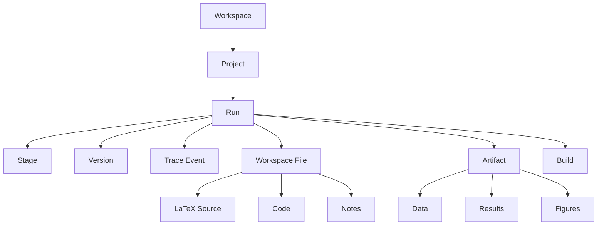

# Information Architecture

## 1. Canonical Domain Model

The UI should expose a clean hierarchy that maps directly onto the current run directory model.



### Proposed objects

| UI object | Backed by | Notes |
| --- | --- | --- |
| Project | logical grouping over runs | not explicit in current code yet, should be added by the app layer |
| Run | `runs/<run_id>/` | already first-class |
| Stage | `run_manifest.json`, `stages/*.md` | already first-class |
| Trace Event | `logs_raw.jsonl`, `logs.txt`, `operator_state/*.json` | already first-class |
| Artifact | `artifact_index.json`, `workspace/` | already first-class |
| Version | new UI abstraction over labels and snapshots | should be added |
| Build | `workspace/writing/main.pdf`, `main.log`, `build_log.txt` | already first-class for writing |

## 2. Navigation Model

### Global left rail

- Projects
- Inbox
- Active Runs
- Waiting For Approval
- Files
- Recent Versions
- Settings

### Project-level tabs

- Overview
- Runs
- Files
- Writing
- Trace
- Versions

### Run-level tabs

- Summary
- Stages
- Artifacts
- File Explorer
- Writing Studio
- Trace Timeline
- Logs

## 3. Default Landing Screen

The app should open on `Projects`, not the latest raw run.

Reason:

- the user explicitly wants multi-project management
- run directories are too low-level as the only entry point
- it becomes much easier to distinguish paused work, completed work, and writing-heavy work

## 4. Project Hub Information Density

The hub should answer six questions in under ten seconds:

1. What research projects exist?
2. Which ones are active right now?
3. Which ones need human attention?
4. Which ones are blocked?
5. Which run is the latest for each project?
6. Which project contains a manuscript worth opening?

### Project card fields

- project title
- one-line thesis
- current mode: `Human` or `AutoR`
- active run id
- latest completed stage
- waiting state
- last updated timestamp
- key artifact badges:
  - PDF
  - figures
  - results
  - blocked

## 5. Run Workspace Structure

The run workspace is the main operating view.

### Recommended layout

```text
Left rail
- Project switcher
- Run switcher
- Stages
- Files
- Artifacts

Center
- main task surface
- stage summary, editor, PDF, or selected artifact

Right rail
- action panel
- metadata
- version labels
- trace detail

Bottom panel
- compile log
- raw event stream
- terminal
- notifications
```

## 6. Stage Rail Design

The stage rail should be a permanent element, not a hidden stepper.

Each stage row should show:

- stage number and title
- status:
  - pending
  - running
  - needs review
  - approved
  - stale
  - failed
- attempt count
- last actor:
  - human
  - AutoR
- artifact count
- short timestamp

### Stage actions

- open summary
- iterate this stage
- rerun from here
- rollback to here
- save version here
- compare with previous approved version

## 7. Files And Artifact Browsing

The left file tree should combine two views:

- `Files`
  - a normal VS Code-style tree over `workspace/`
- `Artifacts`
  - a semantically grouped tree from `artifact_index.json`

This separation matters because researchers sometimes think by folder path and sometimes by evidence type.

### Artifact explorer groups

- Data
- Results
- Figures
- Writing
- Reviews
- Notes

### Preview behavior

- images open inline
- JSON opens with schema summary and pretty view
- markdown opens in rendered plus source tabs
- PDF opens in preview pane
- LaTeX opens in source editor with jump-to-preview actions

## 8. Human And AutoR Modes

This needs a visible, explicit switch near the top bar.

### Human mode

- large, visible approval buttons
- next step suggestions
- prompt revision entry
- section-level iterate actions

### AutoR mode

- progress banner
- pause button
- next breakpoint selector
- queue of pending actions
- compact live trace

## 9. Versioning Model

Versioning should not be a hidden git-style primitive for expert users only.

### User-facing version types

- Auto checkpoint
  - created on each approved stage
- Named milestone
  - user-labeled
- Branch point
  - user starts a partial iteration from a specific stage or file
- Build snapshot
  - saved around successful manuscript compile

### Version card fields

- label
- source stage
- reason
- created by
- created at
- changed files
- restore options

## 10. Partial Iteration Model

This is a priority feature because the codebase already has stage-local continuation and rollback behavior.

### Supported iteration entry points

- iterate an entire stage
- iterate a single manuscript section
- iterate one figure or result explanation
- iterate a selected file subtree
- rerun writing from latest approved analysis

### UX rule

Partial iteration should always answer:

- what is the target scope?
- what stays frozen?
- what gets recomputed?
- what prior version can I return to?

## 11. Writing Studio IA

The writing studio should be a dedicated sub-product inside AutoR.

### Core panes

- File tree
- LaTeX editor
- PDF preview
- compile log
- citation checks
- stage context

### Default tabs

- Source
- PDF
- Build
- Citations
- Packaging

### Manuscript-aware quick actions

- recompile
- open latest paper package
- show citation verification
- jump to method diagram
- compare with previous draft
- save manuscript milestone

## 12. Trace IA

Trace should exist at two levels:

### Executive trace

- stage started
- stage completed
- approval requested
- approval granted
- stage rerun
- rollback triggered
- build passed or failed

### Deep trace

- prompt sent
- session id
- raw assistant event
- tool call
- recovery attempt
- validation failure
- local normalization

This two-layer trace prevents the UI from overwhelming normal users while still giving power users full control.

## 13. State Taxonomy

### Run states

- Draft
- Running
- Waiting for approval
- Blocked
- Paused
- Completed
- Archived

### Build states

- Clean
- Compiling
- Failed
- Stale preview

### Version states

- Current
- Saved
- Restored
- Branched

## 14. Backend Implications

The design suggests several future app-layer additions:

- a `projects.json` or database layer mapping projects to runs
- version labels stored outside raw filesystem timestamps
- indexed trace API over `logs_raw.jsonl`
- compile service with live status
- unified metadata for “selected scope iteration”

None of that changes the current repo truth model. It simply makes it consumable by a UI.
