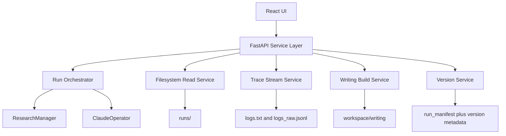
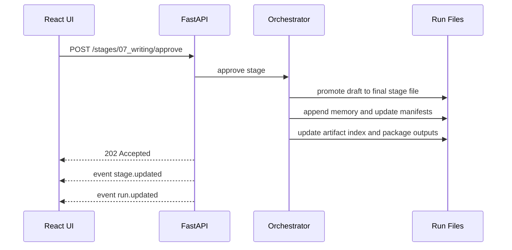
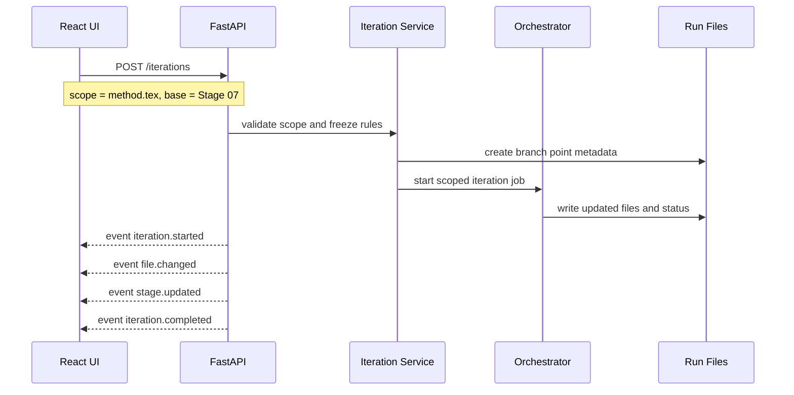
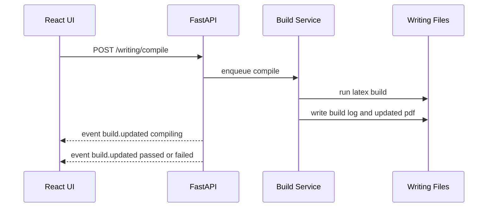

# System Architecture

## 1. Goal

This document describes how the future AutoR UI should talk to the backend, how the backend should map onto the current Python codebase, and how the system should stay reloadable and resumable at every step.

The key design decision is:

**keep the filesystem as the research source of truth, and add a service layer that makes it UI-friendly**

That matches the current repository well because the real state already lives in:

- `runs/<run_id>/run_manifest.json`
- `runs/<run_id>/stages/*.md`
- `runs/<run_id>/logs.txt`
- `runs/<run_id>/logs_raw.jsonl`
- `runs/<run_id>/workspace/**`
- `runs/<run_id>/artifact_index.json`

## 2. Recommended Product Shape

### Frontend

- React
- TypeScript
- Vite
- TanStack Router
- TanStack Query
- Monaco Editor
- PDF.js
- a light state layer only for transient UI state

### Backend

- FastAPI
- Pydantic
- Uvicorn
- Python background worker processes or background tasks
- Watchdog or polling-based file watchers
- optional SQLite for project indexing and saved version metadata

### Why this stack

- the backend can directly call the current Python modules
- the frontend gets fast iteration and strong local state patterns
- Monaco and PDF.js are already the right primitives for LaTeX and file inspection
- FastAPI makes it easy to expose both REST and streaming endpoints

## 3. Recommended Deployment Model

### Initial mode

- local backend process
- local web frontend
- same machine as the AutoR workspace

### Later mode

- single-user desktop shell using Tauri or Electron
- team-hosted backend for shared projects

The first version should stay local-first. AutoR is file-heavy and already optimized around local runs.

## Implemented Foundation In This Branch

The repository now includes a first backend foundation module:

- `src/studio_service.py`

It does not expose HTTP yet. Instead it stabilizes the backend semantics that the future API layer should wrap:

- project metadata storage under a local app metadata root
- run summary loading from manifests and configs
- stage document access
- workspace file tree generation
- iteration planning for `continue`, `redo`, and `branch`

This keeps the first implementation dependency-light while establishing the state model required by the UI.

## 4. System Boundaries



## 5. Core Backend Services

### Project Service

Responsibilities:

- group runs into user-facing projects
- store project title, thesis, tags, and default mode
- identify latest active run per project

Suggested storage:

- `projects.json` for the first cut, or
- SQLite once filtering and search matter

### Run Orchestration Service

Responsibilities:

- create a new run
- start a run
- resume a run
- redo from stage N
- rollback to stage N
- run scoped iteration jobs

This service should wrap existing Python logic instead of reimplementing it.

### File And Artifact Service

Responsibilities:

- list file tree
- return file content
- return artifact index
- return previews and metadata

### Trace Stream Service

Responsibilities:

- tail `logs_raw.jsonl`
- tail `logs.txt`
- emit normalized UI events

### Writing Build Service

Responsibilities:

- compile LaTeX
- read build logs
- publish compile status
- expose generated PDF metadata

### Version Service

Responsibilities:

- create auto checkpoints
- create named milestones
- create branch points
- restore a saved version
- compute diffs between saved states

## 6. Source Of Truth Rules

### Filesystem remains canonical for:

- stage files
- manuscript files
- results, figures, and artifacts
- raw logs
- run manifest

### Service metadata is canonical for:

- project grouping
- UI preferences
- named version labels
- branch lineage
- saved compare views

This split avoids corrupting the existing AutoR run model while still giving the UI richer behaviors.

## 7. Backend Integration Strategy

There are two realistic ways to connect the backend to the current code:

### Option A: Direct Python integration

- import `ResearchManager`, `ClaudeOperator`, and `RunPaths`
- start jobs from FastAPI worker tasks
- read and write manifests directly

### Option B: CLI wrapper

- backend shells out to `python main.py ...`
- backend watches run directories and logs

### Recommendation

Start with **direct Python integration** for reads and simple actions, but keep a thin fallback path for CLI invocation if long-running worker isolation becomes useful.

Reason:

- the repo already exposes usable Python entry points
- direct integration reduces brittle process parsing
- the same code can later be moved into worker subprocesses without changing the API contract

## 8. API Contract V1

### Project endpoints

| Method | Route | Purpose |
| --- | --- | --- |
| `GET` | `/api/projects` | list projects |
| `POST` | `/api/projects` | create project |
| `GET` | `/api/projects/{project_id}` | project summary |
| `PATCH` | `/api/projects/{project_id}` | rename, retag, update mode |

### Run endpoints

| Method | Route | Purpose |
| --- | --- | --- |
| `GET` | `/api/runs/{run_id}` | full run overview |
| `POST` | `/api/runs` | create and start run |
| `POST` | `/api/runs/{run_id}/resume` | resume latest pending state |
| `POST` | `/api/runs/{run_id}/redo` | restart from a chosen stage |
| `POST` | `/api/runs/{run_id}/rollback` | invalidate downstream and continue |
| `POST` | `/api/runs/{run_id}/pause` | request pause |
| `POST` | `/api/runs/{run_id}/mode` | switch Human or AutoR mode |

### Stage endpoints

| Method | Route | Purpose |
| --- | --- | --- |
| `GET` | `/api/runs/{run_id}/stages/{stage_slug}` | stage summary and metadata |
| `POST` | `/api/runs/{run_id}/stages/{stage_slug}/approve` | approve and continue |
| `POST` | `/api/runs/{run_id}/stages/{stage_slug}/refine` | continue with feedback |
| `POST` | `/api/runs/{run_id}/stages/{stage_slug}/rerun` | rerun stage in place |

### File and artifact endpoints

| Method | Route | Purpose |
| --- | --- | --- |
| `GET` | `/api/runs/{run_id}/files/tree` | file tree |
| `GET` | `/api/runs/{run_id}/files/content` | source content |
| `GET` | `/api/runs/{run_id}/artifacts` | artifact index |
| `GET` | `/api/runs/{run_id}/preview` | PDF, image, or rendered markdown preview |

### Writing endpoints

| Method | Route | Purpose |
| --- | --- | --- |
| `POST` | `/api/runs/{run_id}/writing/compile` | compile manuscript |
| `GET` | `/api/runs/{run_id}/writing/status` | build status |
| `GET` | `/api/runs/{run_id}/writing/log` | build log |

### Version and iteration endpoints

| Method | Route | Purpose |
| --- | --- | --- |
| `GET` | `/api/runs/{run_id}/versions` | list saved versions |
| `POST` | `/api/runs/{run_id}/versions` | create checkpoint or milestone |
| `POST` | `/api/runs/{run_id}/versions/{version_id}/restore` | restore saved version |
| `POST` | `/api/runs/{run_id}/iterations` | start scoped iteration |
| `GET` | `/api/runs/{run_id}/diff` | compare two versions |

## 9. Event Streaming Model

The UI should not poll every document aggressively. It should subscribe to normalized backend events.

### Recommended transport

- Server-Sent Events first
- WebSocket later if needed

### Event types

| Event | Meaning |
| --- | --- |
| `project.updated` | project metadata changed |
| `run.updated` | run status changed |
| `stage.updated` | stage state changed |
| `trace.appended` | new trace event available |
| `file.changed` | file written or replaced |
| `artifact.updated` | artifact index changed |
| `build.updated` | compile status changed |
| `version.created` | checkpoint or milestone created |
| `iteration.started` | scoped iteration launched |
| `iteration.completed` | scoped iteration finished |

### Example event payload

```json
{
  "type": "stage.updated",
  "project_id": "proj_sparse_moe",
  "run_id": "20260406_101245",
  "stage_slug": "07_writing",
  "status": "awaiting_human_review",
  "attempt_count": 2,
  "updated_at": "2026-04-09T14:30:12"
}
```

## 10. UI Reload Logic

Reload must be safe at every point.

### On app reload

1. frontend reloads project list
2. frontend reloads selected run overview
3. frontend reloads stage summaries, artifact index, and build status
4. frontend reconnects to the event stream
5. frontend fetches any events newer than the last acknowledged timestamp

### Why this works

Because the canonical state is persisted on disk, the UI can reconstruct itself from:

- `run_manifest.json`
- current files under `workspace/`
- latest stage markdown
- latest trace logs

The UI does not need to hold fragile in-memory workflow state as the only truth.

## 11. Stage Approval Sequence



## 12. Scoped Iteration Sequence



## 13. Writing Compile Sequence



## 14. How To Support "Start From Any Step"

There are three different meanings, and the UI should expose them separately.

### A. Continue in place

Use when:

- the user wants to refine the current stage
- no upstream context changes

Backend behavior:

- continue current session if possible
- write a new attempt
- keep run identity unchanged

### B. Roll back in place

Use when:

- the user wants to redo from stage N
- downstream stages should become stale

Backend behavior:

- call the equivalent of current rollback logic
- mark target stage dirty
- mark downstream stages stale
- continue from the selected stage

### C. Branch from a checkpoint

Use when:

- the user wants to explore an alternative direction
- the current approved run should stay intact

Backend behavior:

- clone metadata and selected workspace state into a new run lineage
- record `branched_from_run_id` and `branched_from_version_id`
- continue from the requested step in the new branch

The UI should force the user to choose one of these explicitly. Otherwise “start from this step” becomes ambiguous and dangerous.

## 15. Version Storage Model

The current codebase already has enough structure for auto checkpoints. The service layer should add named metadata on top.

### Suggested version record

```json
{
  "version_id": "ver_20260409_143012",
  "run_id": "20260406_101245",
  "kind": "named_milestone",
  "label": "Good writing draft before method rewrite",
  "source_stage_slug": "07_writing",
  "created_by": "human",
  "created_at": "2026-04-09T14:30:12",
  "base_manifest_path": "runs/20260406_101245/run_manifest.json"
}
```

## 16. Recommended Backend Folder Additions

These additions would help without fighting the current repository:

```text
app/
├── api/
├── services/
├── schemas/
├── workers/
└── db/
```

Possible local metadata files:

- `projects/projects.json`
- `projects/<project_id>/project.json`
- `projects/<project_id>/versions.json`

## 17. Non-Goals For V1

- multi-user realtime collaboration
- cloud sync as the only storage path
- replacing the run filesystem with a database
- rewriting the current workflow engine

V1 should wrap the current system, not replace it.
